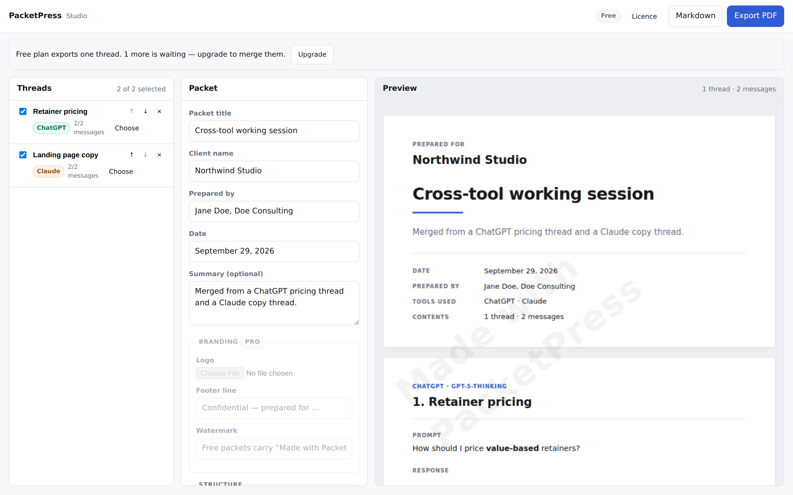

# PacketPress

Merge ChatGPT and Claude threads into one client-ready, branded PDF or Markdown
packet — cover page, table of contents, logo, watermark — without print-to-PDF,
copy-paste, or reformatting.

Built for solo consultants and boutique freelancers who already pay for two
assistants and lose 30–60 unbillable minutes per engagement turning good answers
into something a client will open.



## What it does

1. **Capture** — on a ChatGPT or Claude conversation, click the toolbar button.
   The content script reads the thread, strips the chat chrome (copy buttons,
   avatars, thumbs, "regenerate", screen-reader labels) and keeps the structure
   that matters: headings, lists, fenced code with its language, tables, quotes,
   links.
2. **Merge** — the Studio lists everything captured. Reorder threads, rename
   them for the client, and switch individual messages in or out.
3. **Brand** — client name, prepared-by, date, summary, logo, footer, watermark,
   and your own labels in place of "user" and "assistant".
4. **Export** — one click to a paginated PDF (cover, contents with real page
   numbers, page footers) or to Markdown.

Nothing leaves the machine. Threads live in `chrome.storage.local`, the PDF is
rendered locally by jsPDF, and the only network call is Stripe checkout when you
choose to buy.

## Install (unpacked)

```bash
git clone <this repo> && cd packetpress
npm install          # dev dependencies only — the extension itself has no build step
```

Then in Chrome: **chrome://extensions → Developer mode → Load unpacked →
select the `src/` folder**. `src/` is the extension root; the repo root holds
tests, tools and the licence server.

Open a ChatGPT or Claude conversation, click the PacketPress icon, **Capture
this thread**, then **Open Studio →**.

## Pricing and the licence gate

| | Free | Pro ($12/mo) / One-pack ($29) |
|---|---|---|
| Threads per packet | 1 | unlimited |
| PDF + Markdown export | yes | yes |
| Logo, footer, custom watermark | no | yes |
| "Made with PacketPress" watermark | forced | removed |

Licence keys are ECDSA-signed claim sets verified **offline** in the extension,
so exporting works without a network round-trip and a leaked client build cannot
mint keys. Subscription keys carry a 35-day expiry and are rotated by the server;
a lapsed subscription silently drops the install back to free.

### Running the licence server

```bash
cd server && npm install
cp .env.example .env         # fill in Stripe keys and price ids
npm run keygen               # prints the signing keypair
```

Put the printed `LICENSE_PRIVATE_JWK` in `server/.env`, paste the printed public
JWK into `src/config.js`, then:

```bash
npm start                    # http://localhost:8787
stripe listen --forward-to localhost:8787/api/stripe/webhook
```

`src/config.js` is the only file you edit to deploy: it holds `CHECKOUT_BASE`
(your server's URL) and `LICENSE_PUBLIC_JWK`. The key ships as `null`, so an
unconfigured build fails closed on the free tier rather than giving the product
away. For local testing you can skip editing it: **Studio → Licence → Developer**
accepts a public JWK directly.

Endpoints: `POST /api/checkout`, `POST /api/stripe/webhook`,
`GET /success?session_id=…` (shows the buyer their key — no email infrastructure
needed on day one), `GET /api/license/status`, `POST /api/license/refresh`.

## Development

```bash
npm test               # 76 tests: extraction, adapters, renderers, gating, e2e
npm run preview:pdf    # renders a sample packet's PDF layout to an HTML page
npm run preview:studio # loads the Studio in Chromium and screenshots it
npm run icons          # regenerates the icon set
npm run package        # builds dist/ zips for the Web Store and the server
```

`npm run preview:pdf` draws the real PDF op-stream as SVG, which makes layout
regressions visible without a PDF rasterizer.

## Layout

```
src/                    the extension (load this folder unpacked)
  manifest.json
  config.js             CHECKOUT_BASE + LICENSE_PUBLIC_JWK — the deploy-time edit
  content/              boot bridge + per-vendor adapters
  background/           thread library, settings, licence state
  popup/                capture and library
  studio/               merge, brand, preview, export
  lib/                  extraction, renderers, licensing — all plain ES modules
  vendor/jspdf.umd.min.js
server/                 Stripe checkout + licence issuing
test/                   node:test suites and DOM fixtures
tools/                  dev-only preview and icon generation
```

`src/lib` has no DOM or Chrome dependency beyond what it is handed, which is why
the same extraction and rendering code runs untouched under `node --test`.

## Supporting another assistant

Add an adapter in `src/content/adapters/` exporting `vendor`, `vendorLabel`,
`matches(location)` and `collect(document, location)`, register it in
`adapters/index.js`, and add its host to `manifest.json`. The shared
`htmlToBlocks` walker does the extraction; an adapter only has to find the
message elements and their roles.

## Known limits

- Only messages present in the DOM are captured, so scroll a long conversation
  to load it before capturing.
- Images inside answers are recorded as `[image: alt text]`, not embedded.
- The vendors' markup changes without notice. Adapters use layered selector
  fallbacks so a redesign costs fidelity rather than the whole capture, but
  `test/fixtures/dom.js` is the place to pin new markup when it shifts.
